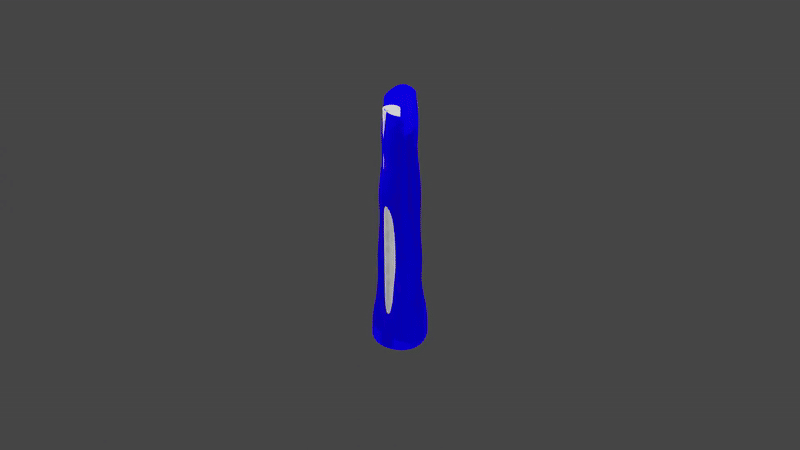
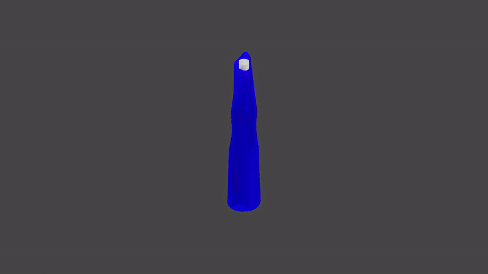
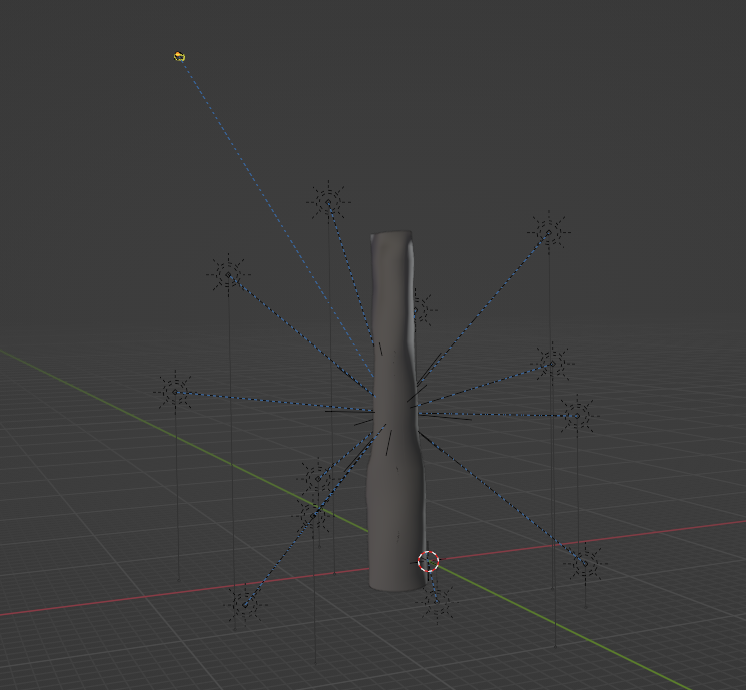
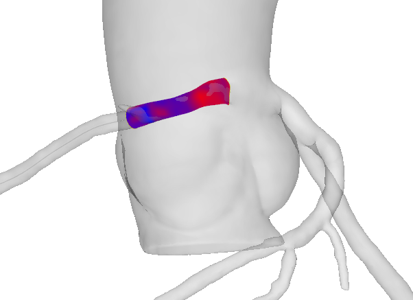

# AAOCA compression simulation
## Description
This code takes the output of the ["AIVUS-CAA"](https://github.com/AI-in-Cardiovascular-Medicine/AIVUS-CAA) and visualizes either pulsatile lumen deformation or stress-induced lumen deformation.


<!-- An example for rest pulsatile lumen deformation:


And with additional uv texture map, depicting the change in distance in red scale:

 -->
An example for rest pulsatile lumen deformation with additionally the IVUS catheter and UV-mapping to depict displacements.


An example for stress pulsatile lumen deformation with additionally the IVUS catheter and UV-mapping to depict displacements.


An example for stress-induced diastolic lumen deformation with additionally the IVUS catheter and UV-mapping to depict displacements.



An example for stress-induced systolic lumen deformation with additionally the IVUS catheter and UV-mapping to depict displacements.



## Installation and Running
```bash
    cargo build
    cargo run
```
This will build 32 meshes, one for diastole and one for systole properly aligned and with 30 interpolated meshes. Additionally the catheter path is reconstruced and a catheter with radius 0.5mm is created, again 32 meshes for the full cardiac cycle.

## Rendering in Blender
To render the animation, blender is needed with version >= v4.0. The script has to be run inside of blender's scripting module. 

To get output of the status of the script in the console run the following:
```PowerShell
    cd '.\Program Files\Blender Foundation\Blender 3.4\'
    .\blender.exe -con 
```
Then copy paste blender_full_animation.py into Scripting module.

Currently the scene setup creates 12 light sources on a sphere with a defined radius around the first mesh. The camera then rotates around the z- and y-axis:


## Aligning with a CCTA-derived centerline
The deformed meshes can additionally be positioned and aligned on a CCTA-derived centerline. The rotation around the the centerline to match anatomical position currently has to be performed by manually specifying a rotation.
