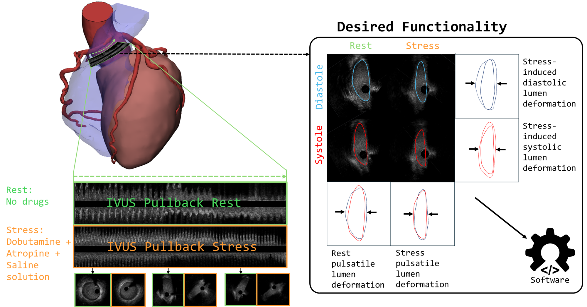
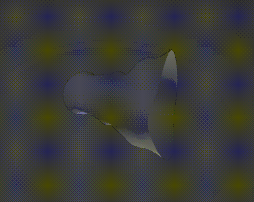
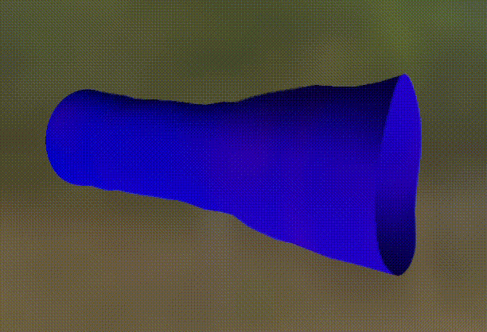

# AAOCA compression simulation
## Description
This code takes the output of the ["AIVUS-CAA"](https://github.com/AI-in-Cardiovascular-Medicine/AIVUS-CAA) and visualizes either pulsatile lumen deformation or stress-induced lumen deformation.



<!-- An example for rest pulsatile lumen deformation:



And with additional uv texture map, depicting the change in distance in red scale:

 -->
An example for rest pulsatile lumen deformation with additionally the IVUS catheter and UV-mapping to depict displacements.


An example for stress pulsatile lumen deformation with additionally the IVUS catheter and UV-mapping to depict displacements.


## Installation and Running
```bash
    cargo build
    cargo run
```
